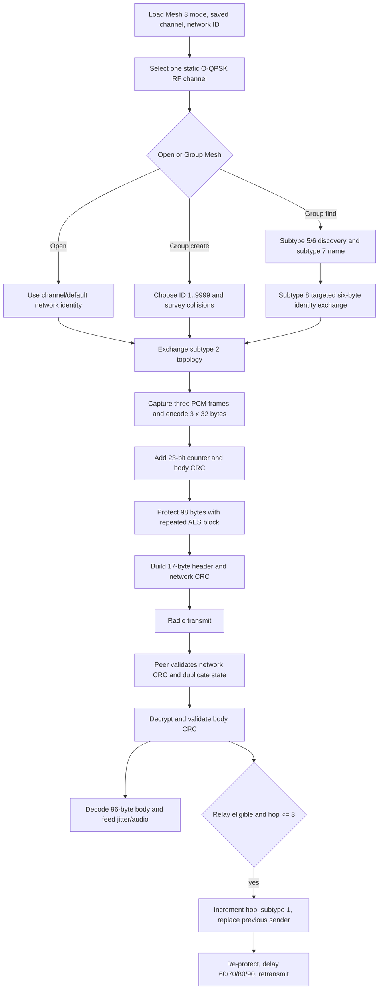

# Sena 30K Mesh Protocol Static Analysis — 2026-09-08

## Executive conclusion

The SP113 `Submesh_v0.5b0.bin` image is not encrypted. It is an Airoha container holding two LZMA-compressed runtime sections. The Cortex-M section exposes separate Mesh 2 and Mesh 3 protocol implementations.

The most important correction from the first analysis pass is the packet boundary:

- **Mesh 2** uses the previously reported 20-byte header and 88-byte subtype-0/1 payload.
- **Mesh 3** uses a distinct, bit-packed **17-byte header**, a variable payload, and a two-byte CRC-16/XMODEM. A protected Mesh 3 audio frame has a 101-byte payload and is exactly **120 bytes** before any lower radio FCS or encapsulation.

Mesh 3 is a bounded, duplicate-suppressed selective-flooding protocol:

1. A logical conversation channel selects one static 2.4 GHz O-QPSK channel.
2. A 14-bit network ID separates mesh instances on that RF channel.
3. Frames carry a 25-bit origin ID, a 25-bit previous-transmitter ID, and optionally a 25-bit forwarding destination.
4. Original protected audio uses subtype 0; relays decrypt it, rewrite the previous-transmitter ID, increment the hop count, change the subtype to 1, and re-protect it for retransmission.
5. Incoming hop counts 0–3 may be forwarded. An incoming count above 3 is dropped by the relay path.
6. Topology advertisements encode up to 19 qualified 25-bit node IDs. Separate sliding-window caches suppress duplicate audio and application records.
7. Mesh 3 audio packets contain three 32-byte codec units. The active path is consistent with three 20 ms Speex narrowband frames, or 60 ms of audio per radio record.
8. Audio protection uses a fixed firmware-wide AES-128 key, one AES output block repeated across 98 bytes, and an unkeyed CRC. Both the 23-bit media counter and 8-bit packet sequence reset to zero when the Mesh 3 task initializes, creating a verified nonce-reuse condition across restarts when the other header inputs repeat.

The radio-facing Cortex-M buffer starts with the custom Mesh 3 header, not an identifiable stock IEEE 802.15.4 MAC header. The lower radio layer may add and remove a conventional MAC header and FCS, or it may use a custom raw PSDU. Static analysis cannot distinguish those cases. PAN ID, MAC addressing, ACK policy, CSMA/CA settings, and the physical FCS boundary therefore remain capture-dependent.

## Evidence terminology

- **Verified:** directly reproduced from the local firmware or unambiguous instruction flow.
- **Strong inference:** multiple independent observations agree, but no over-the-air capture confirms the interpretation.
- **Unknown:** the firmware branch, stripped DSP logic, or lower radio boundary does not expose enough evidence for a reliable semantic assignment.

## Analyzed artifacts

Primary input:

```text
firmware/extracted/30K-v4.5.1-build0/Submesh_v0.5b0.bin
SHA-256: 825e806ee87373a749a66766ac3ef9b1c7601fcc1e32b8dcd2fa1ef09f5ac7cf
```

Comparison input:

```text
firmware/extracted/30K_v3.5-build0/MESH3.0_v3.0.0.7.ldr
SHA-256: ff2b896a2ecb8a3704d0a2c368c1caae23a76a2fa79d29cd87b14e55d919f3b6
```

The earlier baseline is `reports/sena-30k-mesh-3-firmware-esp32-feasibility.md`.

## Recovering the SP113 image

### Airoha container

`Submesh_v0.5b0.bin` has a 32-byte SHA-256 at offset `0x0000`. That hash exactly matches the bytes from file offset `0x0100` through EOF.

The TLV metadata beginning at `0x0100` says:

| Field | Value |
|---|---|
| Compression | `1` = LZMA |
| Encryption | None |
| Integrity | `1` = SHA-256 |
| Compressed firmware offset | `0x1000` |
| Compressed firmware size | `0x1142ac` |
| Platform | `ab156x` |
| Design | `headset_ref_design` |

The mover table describes two output sections:

| Section | Decompressed size | Destination offset | Verified SHA-256 |
|---|---:|---:|---|
| 0 | `0x87000` | `0x13000` | `9392917120bc0bf3426bdc734f130cce6efd593ce84e8d5fad57eb96742e8ea7` |
| 1 | `0x13e000` | `0x133000` | `732cb245b1d0bf8dde9cd35a8ace30ed367ecfedd96936d65adb9f42145edbfe` |

LZMA decompression produced exactly `0x1c5000` bytes. Both section hashes match the hashes stored in the container.

### Runtime split

- Section 0 contains nine embedded Xtensa ELF DSP modules plus stripped audio-oriented code and data.
- Section 1 is ARM Thumb code loaded at virtual address `0x08133000`.
- The Cortex-M section owns mesh state, frame construction and parsing, routing, timers, control integration, and protected-record processing.
- The image contains Speex 1.2.0 narrowband and `libspeexdsp` jitter-buffer material.
- The SDK identifies itself as `IoT_SDK_for_BT_Audio_V2.8.0.AB1565_AB1568`.

Relevant module names include:

```text
mesh_main
mesh_network
mesh_trx
mesh_uart
mesh_speex
mesh_audio
intercom_module
mesh_intercom_config
```

## Radio and logical channel selection

### Physical-layer evidence

FCC evidence establishes 2.4 GHz O-QPSK operation from 2410 through 2475 MHz. The runtime adds these observations:

- received radio buffers copy at most `0x7d` = 125 bytes;
- the receive ring has nine slots with a `0x8c` = 140-byte stride;
- the largest recovered constructor emits a 125-byte Mesh 3 network frame; protected audio is exactly 120 bytes;
- no frequency-hopping sequence was found in the Cortex-M mesh code.

A 125-byte receive limit is compatible with an IEEE 802.15.4 127-byte PSDU after a two-byte hardware FCS is removed. Compatibility is not proof of stock MAC framing.

### Static channel maps

The firmware persists three one-byte settings under NVDM group `intercom`:

```text
m2_rf_param
m3_rf_param
mesh_mode_param
```

Both RF parameter bytes pack three fields:

- bits 0–3: value 0–15;
- bits 4–5: value 0–3;
- bits 6–7: value 0–2.

The exact meanings of the upper two fields remain unknown. Defaults are `(0,3,0)` for Mesh 2 and `(0,2,0)` for Mesh 3. `mesh_mode_param` defaults to 3.

| Mode | Logical channel | IEEE 802.15.4 channel | Center frequency |
|---|---:|---:|---:|
| Mesh 3 | default/0 | 16 | 2430 MHz |
| Mesh 3 | 1 | 20 | 2450 MHz |
| Mesh 3 | 2 | 14 | 2420 MHz |
| Mesh 3 | 3 | 22 | 2460 MHz |
| Mesh 3 | 4 | 12 | 2410 MHz |
| Mesh 3 | 5 | 24 | 2470 MHz |
| Mesh 3 | 6 | 18 | 2440 MHz |
| Mesh 2 | default/0 | 19 | 2445 MHz |
| Mesh 2 | 1 | 13 | 2415 MHz |
| Mesh 2 | 2 | 14 | 2420 MHz |
| Mesh 2 | 3 | 15 | 2425 MHz |
| Mesh 2 | 4 | 16 | 2430 MHz |
| Mesh 2 | 5 | 17 | 2435 MHz |
| Mesh 2 | 6 | 22 | 2460 MHz |
| Mesh 2 | 7 | 23 | 2465 MHz |
| Mesh 2 | 8 | 24 | 2470 MHz |
| Mesh 2 | 9 | 21 | 2455 MHz |

The raw tables are at virtual addresses `0x08236fc9` for Mesh 3 and `0x0823700c` for Mesh 2. Frequencies use the standard relation $2405 + 5(ch-11)$ MHz.

## Mesh 3 network frame

### Exact frame boundary

The generic constructor at `0x081a81b0`, manual audio constructor around `0x081a9e32`, relay at `0x081a8300`, and receive parser around `0x081aa112` establish:

```text
17-byte Mesh 3 header || payload || 2-byte little-endian network CRC
```

The CRC covers the complete 17-byte header and payload. It is CRC-16/XMODEM/CCITT: polynomial `0x1021`, initial value `0x0000`, no reflection, no final XOR.

### Bit-packed header

| Byte | Bits | Width | Verified meaning |
|---:|---:|---:|---|
| 0 | 0–2 | 3 | aggregation/count field; generic control frames use 1, audio uses 3 |
| 0 | 3 | 1 | optional destination present |
| 0 | 4–7 | 4 | protocol version; current constructor returns 1 |
| 1 | 0–7 | 8 | network ID bits 0–7 |
| 2 | 0–5 | 6 | network ID bits 8–13 |
| 2 | 6–7 | 2 | origin node ID bits 0–1 |
| 3 | 0–7 | 8 | origin node ID bits 2–9 |
| 4 | 0–7 | 8 | origin node ID bits 10–17 |
| 5 | 0–6 | 7 | origin node ID bits 18–24 |
| 5 | 7 | 1 | previous-transmitter ID bit 0 |
| 6 | 0–7 | 8 | previous-transmitter ID bits 1–8 |
| 7 | 0–7 | 8 | previous-transmitter ID bits 9–16 |
| 8 | 0–7 | 8 | previous-transmitter ID bits 17–24 |
| 9 | 0–7 | 8 | optional destination ID bits 0–7 |
| 10 | 0–7 | 8 | optional destination ID bits 8–15 |
| 11 | 0–7 | 8 | optional destination ID bits 16–23 |
| 12 | 0 | 1 | optional destination ID bit 24 |
| 12 | 1–7 | 7 | payload length, 0–127 |
| 13 | 0–4 | 5 | packet subtype |
| 13 | 5–7 | 3 | hop count |
| 14 | 0–7 | 8 | packet sequence |
| 15–16 | — | 16 | normally zero; local transport/buffer context when nonzero |

The semantic broadcast destination is `0x03ffffff`. It is not serialized as a 26-bit field: byte 0 bit 3 is cleared and bytes 9–12's destination bits are zero. The nonce builder substitutes `3f ff ff ff` for this broadcast case.

Bytes 15–16 are zero in ordinary constructed frames and participate in the network CRC. Nonzero values select a local zero-copy/buffer path through `0x081a234a`; they are not the network CRC. Whether the radio transport overlays these bytes after validation or serializes a nonzero form is still unknown. A compatible first transmitter should emit zero until a capture proves otherwise.

### Address semantics

The three 25-bit values have distinct roles:

- **origin:** created by the source and preserved across relays;
- **previous transmitter:** initially the source, replaced with the local ID by every relay;
- **optional destination:** selected by source/control logic and preserved by relays.

Audio processing is not limited to the optional destination. The field participates in forwarding selection and nonce construction, so it is better described as a forwarding destination or routing hint than as an application-layer final recipient.

The local 25-bit ID is derived from bytes 2–5 of an opaque six-byte device identifier:

```text
if device_id[2] == 0x95:
    node_id = device_id[3] << 16 | device_id[4] << 8 | device_id[5]
else:
    node_id = 0x01000000 | device_id[3] << 16 | device_id[4] << 8 | device_id[5]
```

The firmware accepts the six-byte identifier through a controller command. Its origin is not statically proven to be a Bluetooth address, so it should not be labeled a MAC address.

### Reproduced parser vector

A clean-room pack/unpack implementation produced this valid frame:

```text
193492158d046f5e0d20100004497e0000aabb762e
```

Decoded values:

```text
version/aggregation: 1 / 1
network ID:          0x1234
origin ID:           0x123456
previous sender:     0x1abcde
destination ID:      0x001020
payload length:      2
subtype / hop:       9 / 2
packet sequence:     0x7e
payload:             aa bb
CRC, little-endian:  76 2e
```

Repacking and parsing round-tripped every field and independently validated the CRC.

## Mesh 3 packet subtypes

Subtype is `header[13] & 0x1f`.

| Subtype | Payload | Verified behavior | Assigned role |
|---:|---|---|---|
| 0 | exactly 101 bytes | freshness check, decrypt/CRC verify, decode, then consider relay | original protected audio |
| 1 | exactly 101 bytes | freshness check, decrypt/CRC verify, decode, then consider another relay | relayed protected audio |
| 2 | zero bytes when `N = 0`; otherwise `3 × (N + 1)` bytes, `N ≤ 19` | imports qualified node IDs and reachability state | topology advertisement |
| 5 | 2-byte network ID | sent every 100 timer units during the discovery action; outer network ID forced to `0x3fff` | network discovery query |
| 6 | 2-byte network ID | targeted response to subtype 5; outer network ID forced to `0x3fff` | network discovery response |
| 7 | variable string, bounded by a 32-byte name buffer | receive emits controller event `0x4032` and records the advertising network | network-name advertisement |
| 8 | exactly 6 bytes | targeted; receive requires local destination and Mesh 3 mode, emits event `0x4031` | invitation/admission identity |
| 9 | zero bytes | targeted probe; receiver extracts the request frame's low network-CRC byte | link/channel probe request |
| 10 | 1 byte | echoes the subtype-9 request CRC byte; survey code counts responses and sums request/response CRC bytes | probe response |
| 11 | 4-byte counter prefix plus 0–102 application bytes | separate duplicate cache, optional controller delivery, selective flooding | unprotected application/control record |

Subtypes 3, 4, and 12–31 have no constructor and no branch in the recovered Mesh 3 receive task. They are reserved or ignored in this implementation.

### Subtype 2 topology payload

The topology builder at `0x081aa83e` zeroes a 60-byte workspace and emits:

```text
bytes 0..2: bit-24 bitmap for advertised IDs
then N entries:
    three-byte little-endian low 24 bits of node ID
```

When `N = 0`, the builder emits a zero-length payload. Otherwise the payload length is `3 × (N + 1)`: the three-byte bitmap followed by `N` three-byte IDs.

Only qualified cache records are advertised:

- at most 19 entries;
- record field at offset 4 must be at least `0x560` = 1376;
- its 32-bit recent-sequence bitmap must contain at least 23 set bits.

Those numeric thresholds are verified. Their exact human meaning—age, link quality, or accumulated liveness—is not.

### Subtype 11 application record

The subtype-11 payload is:

| Offset | Size | Meaning |
|---:|---:|---|
| 0 | 4 | little-endian counter; increment is masked to 24 bits, so the high byte is normally zero |
| 4 | 0–102 | application bytes |

The receiver extracts the low 24 bits for duplicate suppression. It maintains 19 per-origin entries, each with a sliding recent-counter bitmap, and refreshes an expiry value of `0x226` = 550 timer units. This path is not encrypted by the Mesh 3 protected-audio routine.

## Discovery and admission

### Controller states

The state-name table at `0x08233ad4` contains:

| Value | State |
|---:|---|
| 0 | `INIT` |
| 1 | `FINISH_INIT` |
| 2 | `START` |
| 3 | `STOP` |
| 4 | `READY` |
| 5 | `STANDBY` |
| 6 | `FINDING_NETWORK` |
| 7 | `LEAVE_NETWORK` |
| 8 | `FIND_NETWORK` |
| 9 | `CHANGE_NETWORK_MODE` |
| 10 | `CHANGE_CHANNEL` |
| 11 | `MUSIC_SHARING_REQ` |
| 12 | `ALLOW_MUSIC_SHARING` |
| 13 | `DENY_MUSIC_SHARING` |
| 14 | `RF_TEST_MODE` |

The state setter at `0x081a38fc` emits controller event `0x34`. While in `FIND_NETWORK`, it refuses direct transitions to `CHANGE_CHANNEL` and `DENY_MUSIC_SHARING`.

### Persisted mesh identity

`mesh_intercom_config` is a 20-byte NVDM record. Its first four bytes are used as:

| Offset | Size | Meaning |
|---:|---:|---|
| 0 | 1 | Open/Group mode flag; default 0 |
| 1 | 1 | selected physical-channel code; default `0x10` in Mesh 3 and `0x13` in Mesh 2 |
| 2 | 2 | little-endian network ID |

The mode assignment below is a strong inference from defaults, state transitions, and saved-network behavior:

- mode 0 is Open Mesh;
- mode 1 is Group Mesh.

### Open Mesh

The default persisted record has mode 0 and network ID 0. Open Mesh operation therefore appears to derive shared admission from the selected conversation/RF channel rather than an invitation exchange. No per-peer pairing record or Open Mesh credential derivation appears in the recovered network path.

What is verified:

- all nodes use the selected static RF channel;
- frames carry the current 14-bit network ID;
- default network ID is zero;
- subtype-2 topology and subtype-0/1 audio then build the live flooding graph dynamically.

The exact rule for a non-default Open Mesh network ID is not proven.

### Group Mesh creation and admission

The recovered sequence is:

1. **Choose a candidate group network ID.** The creator draws a pseudorandom value from 1 through 9999.
2. **Collision survey.** It listens for 1500 timer units and rejects the candidate if any received Mesh 3 frame carries that 14-bit network ID.
3. **Commit, including a firmware truncation anomaly.** After a collision-free survey, `0x081aab02` executes `UXTB r0, r5` before the halfword store, so it persists `candidate & 0xff`, not the surveyed 1–9999 value. This can even commit zero. It makes up to three surveyed attempts; if all three collide, the unsurveyed fallback stores a fresh full-width 1–9999 value without that truncation.
4. **Advertise/find.** Subtype 5/6 exchanges occur outside a group-specific network by forcing the outer header network ID to `0x3fff`. The two-byte payload carries the committed network ID.
5. **Expose a human-selectable group.** Subtype 7 advertises the stored network name and produces event `0x4032` at a finder.
6. **Admission identity.** Subtype 8 is targeted to one 25-bit node and carries the sender's opaque six-byte device identifier. A successful receive produces event `0x4031`.
7. **Persist.** Mode, physical channel, and 14-bit network ID are copied into `mesh_intercom_config`, allowing later return to the saved Group Mesh.

This is an identifier-based admission flow. The recovered Mesh 3 record layer does not derive a key from the group ID, name, or six-byte identity; every group uses the same fixed AES key described below. No cryptographic authenticator was found in subtype 5–10 payloads.

A separate Bluetooth/controller exchange could still authorize the user action before these mesh messages are sent. Static Cortex-M evidence does not establish that external UX/control boundary.

### Probe exchange

Subtype 9/10 is not an audio acknowledgement:

- subtype 9 is targeted and has no payload;
- its receiver copies the low byte of the subtype-9 frame's network CRC into a one-byte subtype-10 response;
- a survey helper accepts only subtype 10 addressed to the local node and accumulates response count, echoed request byte, and response CRC byte.

This is consistent with link or channel-quality probing. The exact formula consuming those three aggregates remains unassigned.

## Routing, duplicate suppression, and timing

### Selective flooding

The Mesh 3 relay at `0x081a8300`:

1. reads the three-bit hop count from byte 13;
2. drops an incoming value greater than 3;
3. extracts origin and previous-transmitter IDs;
4. checks recent/reachability state to avoid unnecessary forwarding;
5. increments the hop count;
6. rewrites subtype 0 to subtype 1;
7. replaces the previous-transmitter ID with the local 25-bit ID;
8. preserves origin, optional destination, payload, and packet sequence;
9. queues the rewritten frame after a topology-dependent delay.

Audio is decrypted and body-CRC checked before this relay function runs. Because byte 13 changes, the protection nonce changes. The outbound path therefore re-encrypts the plaintext for each hop rather than forwarding the received ciphertext unchanged.

An incoming count of 3 may leave a relay as count 4. The next relay drops it. This is controlled rebroadcast, not conventional destination-to-next-hop routing.

### Relay scheduling

| Active topology records | Delay/window argument |
|---:|---:|
| 0–4 | 60 |
| 5–6 | 70 |
| 7–10 | 80 |
| 11+ | 90 |

These corrected values are selected identically in the normal and subtype-11 relay functions.

The timer abstraction stores a duration beside a sampled system counter. No conversion constant is present at these call sites. Milliseconds are a strong inference because the same API receives 100 for discovery cadence, 1500 for collision-survey dwell, and 30000 for a user-visible network action timeout.

### Other exact timer arguments

| Operation | Argument | Interpretation |
|---|---:|---|
| subtype-5 discovery query cadence | 100 | likely 100 ms |
| group-ID collision survey | 1500 | likely 1.5 s per attempt |
| admission/network action timeout | 30000 | likely 30 s |
| subtype-11 duplicate-entry refresh | 550 | likely 550 ms |
| one later control timeout | 5000 | likely 5 s |

These are firmware arguments. A radio capture is still required to measure SFD-to-SFD timing and contention jitter.

### Duplicate and reachability state

Mesh 3 uses multiple bounded caches:

- a linked topology/reachability cache with up to 19 advertised entries;
- six protected-audio source slots with counter/window state;
- 19 subtype-11 origin slots with a 24-bit counter and recent bitmap;
- an 8-bit per-frame packet sequence, incremented globally and preserved by relays.

The sliding windows tolerate modest reordering while suppressing repeat forwarding. No per-audio-frame ACK or retransmission loop appears in this path. Reliability comes from redundant selective flooding, duplicate rejection, and audio jitter buffering.

## Mesh 3 protected audio record

### Exact layout

Subtypes 0 and 1 require exactly 101 payload bytes:

| Offset | Size | Meaning |
|---:|---:|---|
| 0 | 3 | little-endian 24-bit media counter; bit 23 is the encrypted flag |
| 3 | 96 | codec body |
| 99 | 2 | little-endian CRC-16/XMODEM of the 96-byte plaintext body |

The transmitter:

1. writes the low 23 counter bits;
2. copies 96 codec bytes;
3. appends the body CRC;
4. protects bytes 3–100;
5. sets counter bit 23;
6. computes the separate network-frame CRC over header plus protected payload.

The receiver requires the encrypted flag, clears it for nonce construction, decrypts 98 bytes, verifies the body CRC, and leaves the flag cleared only on success.

### AES key and construction

The AES-128 key at `0x08237250` is:

```text
0a717f0190374345baf96f49781fa41c
```

The key expansion and normal ten-round AES block implementation are at `0x081aabc8` and `0x081aac70`.

Protection is:

```text
keystream = AES128_encrypt(fixed_key, nonce)
for i in 0..97:
    protected[i] = plaintext_body_and_crc[i] XOR keystream[i mod 16]
```

It is not standard CTR mode: the firmware never increments the input block. It repeats the same 16-byte AES output across all 98 bytes.

### Exact nonce

Given the 17-byte Mesh 3 header and 23-bit media counter `c`:

```text
nonce[0]  = origin bits 0..7
nonce[1]  = origin bits 8..15
nonce[2]  = origin bits 16..23
nonce[3]  = 0xce if origin bit 24 is 1, else 0x95
nonce[4]  = network ID bits 0..7
nonce[5]  = network ID bits 8..13
nonce[6]  = c bits 16..22
nonce[7]  = c bits 8..15
nonce[8]  = c bits 0..7
nonce[9]  = packet sequence, header byte 14
nonce[10] = 0xc7
nonce[11] = full subtype/hop byte, header byte 13
```

For a unicast/forwarding destination:

```text
nonce[12] = 0xce if destination bit 24 is 1, else 0x95
nonce[13] = destination bits 16..23
nonce[14] = destination bits 8..15
nonce[15] = destination bits 0..7
```

For broadcast:

```text
nonce[12..15] = 3f ff ff ff
```

### Reproduced AES vector

For:

```text
network ID:      0x0234
origin ID:       0x123456
broadcast
media counter:   0x123456
packet sequence: 0x42
subtype/hop:     0 / 0
```

the reconstructed nonce is:

```text
56341295340212345642c7003fffffff
```

AES-128-ECB of that block with the firmware key is:

```text
3ff8234ab412d5cee0025970696cdcf4
```

For a 96-byte plaintext body containing byte values 0 through 95, the body CRC is `0x65a9`, serialized `a9 65`. Encrypt/decrypt round-tripped all 98 protected bytes and revalidated the CRC.

### Security consequences

Verified:

- the key is recoverable from every firmware copy;
- positions separated by 16 bytes use the same keystream byte;
- the CRC is unkeyed and forgeable;
- equal nonce inputs produce equal keystream;
- the Mesh 3 task initialization at `0x081a95e4` and `0x081a95f0` resets packet sequence and media counter to zero.

Therefore nonce reuse across task/device restarts is not merely hypothetical: it occurs whenever origin, network, destination, hop/subtype, and the reset counters repeat. Broadcast source traffic on a saved group is the clearest case.

The construction provides obfuscation and accidental-error detection, not authenticated confidentiality. A compatible implementation must reproduce it for interoperability, but should not treat it as a security boundary.

## Audio codec and framing

Mesh initialization at `0x081a3810` selects:

| Mode | Codec unit | Codec body | Radio payload |
|---|---:|---:|---:|
| Mesh 2 | 42 bytes | 84 bytes | 88 bytes in subtype 0/1 |
| Mesh 3 | 32 bytes | 96 bytes | 101-byte protected record |

The Mesh 3 constructor writes aggregation value 3 into header byte 0. Receive timing computes:

```text
media_byte_offset = aggregation_count × counter23 × 0x140
```

`0x140` is 320 bytes, matching 160 signed 16-bit PCM samples. Combined with the included Speex 1.2.0 narrowband encoder/decoder and jitter buffer, the strong reconstruction is:

- 8 kHz mono signed-16 PCM;
- 160 samples / 320 bytes / 20 ms per codec frame;
- three 32-byte codec units in the 96-byte body;
- 480 PCM samples, or 60 ms, per Mesh 3 protected radio record;
- nominal codec-body rate $96 \times 8 / 0.060 = 12.8$ kbit/s before headers and protection.

The exact internal format of each 32-byte codec unit remains unresolved in the stripped Xtensa DSP code. In particular, static ARM code does not prove:

- the selected Speex submode;
- whether a unit is a padded standard Speex bitstream;
- whether four bytes are per-frame metadata and 28 bytes are compressed speech;
- comfort-noise/VAD packing;
- byte/bit order inside the unit.

That 28+4 interpretation is plausible for a Speex narrowband mode but is not promoted to protocol fact without an encoded-tone capture or a traced DSP call.

## Radio MAC boundary

### What the Cortex-M sees

The receive worker parses byte 0 as the Mesh 3 version/destination/aggregation byte and validates the custom network CRC after the payload. It does not first parse:

- IEEE 802.15.4 Frame Control Field;
- sequence number;
- PAN ID;
- short or extended MAC addresses;
- auxiliary security header.

The first two custom bytes also cannot be a stable stock 802.15.4 FCF because byte 1 contains the low eight bits of the variable 14-bit network ID.

### What remains below this boundary

One of two architectures is likely:

1. **Standard-like outer MAC:** radio firmware strips an outer MHR and two-byte PHY/MAC FCS before delivering the custom Mesh 3 frame, which can be as large as 125 bytes.
2. **Custom raw PSDU:** the custom Mesh 3 bytes begin at the PSDU boundary and radio hardware only supplies/removes the final two-byte FCS.

Static Cortex-M code does not select between them. Consequently:

| Property | Static result |
|---|---|
| PAN ID | unknown below parser boundary |
| source/destination MAC addressing | unknown; mesh uses its own 25-bit IDs |
| ACK request and automatic ACK | no audio ACK path visible; hardware policy unknown |
| CSMA/CA / CCA | lower radio policy unknown |
| MAC retries | no network-layer audio retry found; hardware retries unknown |
| PHY/MAC FCS | strong inference of two-byte hardware FCS; exact polynomial/boundary capture-dependent |
| custom network CRC | verified CRC-16/XMODEM inside the Mesh frame |

Protected audio occupies 120 custom bytes and would produce a 122-byte PSDU if a hardware two-byte FCS follows directly. The largest recovered constructor is subtype 11 at 125 custom bytes; adding exactly that FCS reaches the 127-byte IEEE 802.15.4 limit. A separate outer MHR cannot fit around that maximum-length frame unless the custom length reported by Cortex-M excludes or reuses lower-layer bytes.

## ESP32-C6 implementation requirements

### Feasibility decision

An ESP32-C6 is still the correct low-cost first platform for a compatibility experiment:

- IEEE 802.15.4-2015 O-QPSK PHY;
- 250 kbit/s;
- channels 11–26;
- raw transmit/receive API;
- I2S for PCM;
- AES acceleration, though the recovered construction is simple enough in software.

A regular ESP32 or ESP32-S3 cannot generate this PHY without an external radio.

### Radio bring-up

Use the ESP-IDF raw API, not OpenThread or Zigbee:

1. `esp_ieee802154_enable()`.
2. `esp_ieee802154_set_channel()` using the recovered Mesh 3 channel map.
3. `esp_ieee802154_set_promiscuous(true)`.
4. `esp_ieee802154_set_rx_when_idle(true)`.
5. Register receive/transmit callbacks before enabling, or provide the documented weak callbacks.
6. In the RX ISR callback, copy or queue the frame and promptly call `esp_ieee802154_receive_handle_done()`.
7. Record SFD timestamp, channel, RSSI, LQI, length, and every byte.
8. Keep Wi-Fi and BLE disabled during initial timing work. ESP32-C6 has one shared 2.4 GHz RF path, and coexistence can preempt normal 802.15.4 receive.

The ESP-IDF hardware validates incoming FCS and may drop failures. It also automatically generates the transmit FCS. It is not an SDR. A nonstandard Sena preamble, SFD, chip mapping, symbol rate, or FCS is a hard blocker that requires an IQ SDR or different transceiver.

### Two conditional transmit layouts

After capture, implement exactly one:

```text
ESP length byte || captured outer IEEE 802.15.4 MHR || 120-byte Sena frame
```

or:

```text
ESP length byte || 120-byte Sena frame
```

In both cases, the length supplied to ESP-IDF must account for the hardware-generated two-byte FCS according to the raw API contract. Do not append a guessed IEEE FCS in software. The Sena frame's own final CRC-16/XMODEM remains part of the 120 bytes.

### Required firmware modules

A minimally compatible node needs:

- 17-byte Mesh 3 header packer/parser;
- CRC-16/XMODEM;
- 25-bit ID and 14-bit network-ID helpers;
- subtype 0, 1, 2, and 5–11 handlers;
- 19-entry topology/reachability state;
- six-source protected-audio freshness state;
- subtype-11 24-bit sliding-window cache;
- relay hop rewrite and 60/70/80/90 delayed scheduler;
- 100-unit discovery scheduler and 30,000-unit admission timeout;
- group-ID generation/collision survey;
- persisted mode, RF channel, network ID, group name, and six-byte device identity;
- fixed-key AES block operation and repeated-block XOR;
- 8 kHz mono PCM capture/playback;
- exact Sena 32-byte codec-unit encoder/decoder;
- three-frame aggregation and jitter buffering.

### Practical blocker

The network protocol is now sufficiently specified for a decoder and control-frame prototype. Two blockers remain before native voice interoperability:

1. capture the actual PHY/MAC boundary and access policy;
2. recover the exact 32-byte codec-unit bitstream.

Neither should be guessed. A C6 can test the first blocker immediately; a known-tone capture can solve the second once frames are visible.

## Reconstructed end-to-end operation



## Capture plan and falsifiable predictions

Use two owned 30K units and an ESP32-C6 first, then three Sena units for relay validation:

1. Listen in promiscuous mode on recovered Mesh 3 channels 12, 14, 16, 18, 20, 22, and 24.
2. Record raw bytes and FCS disposition during silence, speech, Open Mesh channel changes, Group Mesh creation, find, invitation, and leave.
3. Search every offset for a 17-byte header followed by the seven-bit payload length and a matching CRC-16/XMODEM.
4. Expect protected audio records to be 120 custom bytes, with byte 0 low bits equal to 3, subtype 0/1 in byte 13, payload length 101, and a valid final network CRC.
5. Force a relay with three RF-separated units. Predicted changes are:
   - origin unchanged;
   - previous-transmitter ID replaced;
   - subtype 0 becomes 1;
   - hop increments;
   - packet sequence remains unchanged;
   - protected bytes change because nonce byte 11 changes;
   - network CRC changes.
6. During Group creation, compare the surveyed candidate with the committed ID. Predict `committed = candidate & 0xff` after a collision-free survey, but a full-width 1–9999 committed ID after three detected collisions. Also expect 1500-unit survey windows, subtype 5/6 under outer network `0x3fff`, subtype 7 carrying the name, and targeted subtype 8 carrying six identity bytes.
7. Feed a fixed 1 kHz tone. Split each decrypted 96-byte body into three 32-byte units and test Speex narrowband submodes and candidate four-byte per-unit prefixes.

If ESP32-C6 reports energy but never a valid frame, its fixed 802.15.4 PHY/FCS logic is incompatible with Sena's lower framing. Continue with IQ capture rather than altering the recovered network parser.

## Tooling and references

- ESP-IDF v5.4.2 raw IEEE 802.15.4 API: [esp_ieee802154.h](https://raw.githubusercontent.com/espressif/esp-idf/v5.4.2/components/ieee802154/include/esp_ieee802154.h)
- ESP32-C6 PHY and MAC capabilities: [ESP32-C6 datasheet](https://documentation.espressif.com/esp32-c6_datasheet_en.pdf)
- ESP32-C6 shared-radio constraints: [ESP-IDF RF coexistence guide](https://docs.espressif.com/projects/esp-idf/en/v5.4.2/esp32c6/api-guides/coexist.html)
- Airoha container conventions: [ramikg/airoha-firmware-parser](https://github.com/ramikg/airoha-firmware-parser)
- Prior public Sena firmware work: [masterX244/SenaFirmwareUtils](https://github.com/masterX244/SenaFirmwareUtils)
- Independent prior notes: [Hackaday — Reverse Engineering the Sena Firmware](https://hackaday.io/project/183686-reverse-engineering-the-sena-firmware)
- Mesh product behavior: [Sena 30K Mesh 3-era user guide](https://firmware.sena.com/senabluetoothmanager/UserGuide_30K_4.4.1_en_250331.pdf)
- SP46 RF evidence: [FCC O-QPSK/ZigBee test report](https://fccid.io/S7A-SP46/Test-Report/Test-Report-1-ZigBee-3574016.pdf)
- SP113 RF evidence: [FCC MESH DTS test report](https://fccid.io/S7A-SP113/Test-Report/Test-Report-DTS-MESH-5800108.pdf)

No public Sena Mesh 3 packet specification was found. The byte layouts, control flows, timing arguments, key, nonce, replay behavior, and decoder vectors above come from the local firmware, with remaining capture-dependent boundaries stated explicitly.
